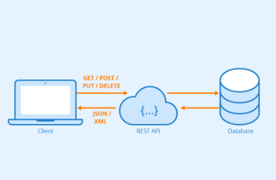

Optamos por utilizar o padrão RESTFul devido a sua facilidade e por possuirmos mais costume.

Na arquitetura RESTful, o cliente realizar uma requisição à Api, onde a mesma processa essa requisição, busca ou altera algo no banco de dados e retorna uma response com um status code, e um message.

